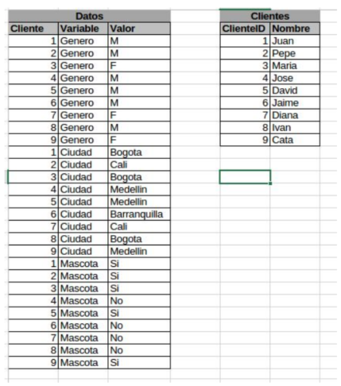

Coding Challengue

**CHALLENGE 2**

Given an array of integers with length N. An array element is peak if it is NOT smaller than its neighbors. An array element is valley if it is NOT greater than its neighbors. For corner elements, we need to consider only one neighbor. For example, for input array {5, 10, 20, 15}, 20 is the only peak element and 5 and 15 are valleys. For input array {10, 20, 15, 2, 23, 90, 67}, there are two peak elements: 20 and 90 and 3 valleys, 10, 2 and 67. We need to return the total number of peaks and valleys.

               0<= length(array) <= 500
 
For the solution feel free to choose the programming language you want. You can use any or output mechanism for the program data. 

Please send:
1. Brief explanation of the solution to the problem
2. Git repository.

Extra points:

● Unit test

**CHALLENGE SQL**

Suppose you have a database with two tables:

 

Write the SQL statement that shows the name of the women who have pets in Bogotá.

Extra points:
- Write the list of names that the ​query​ would generate without using ​subqueries​.

**CHALLENGE WEBAPP**

We are creating an activity meter which sums random nonsense measures.

*Build a Basic Web App*

It should show a real time graphic (it’s better if it uses HTML 5 but it can be anything you want) that graphic should display numbers from 0 to 100 in Y Axis and time in seconds in X Axis, this 
graph should update every second from the data provided by a sum server.

Bonus:

It should add a line for each client connected to the web app in the case you support multiple connected clients.

Please send:

1. Brief explanation of the solution to the problem
2. Architecture and deployment
3. Git repository.
4. Unit test.

**CHALLENGE SERVER APP**

*Build Sum Server*

This Sum server is a small TCP services that listens on one socket (27877) for the incoming data
(numbers 0...20), and sum all the valid inputs within a second (1000ms) to generate a sum result,
then write to another socket (27878) the sum result is sent to any client listening to that port.

Please send:

1. Brief explanation of the solution to the problem.
2. Architecture.
3. Git repository.

Bonus:

It should validate the inputs and close the socket if it is not a valid input.

**BONUS CHALLENGE**

Register the sum server to the web app
You should connect the two previous challenges: The challenge ServerApp and the challenge 
WebApp; every connected client should be shown in the WebApp like another line with the result 
of the sum, if the socket is closed the line will take a red color and then after 5 seconds disappear.

Please send:

1. Brief explanation of the solution to the problem
2. Git repository

Bonus 

Add an automated script/code that generate random input data so that it is easy to visualize all
the software running.

Questions 

Please fill the following questions.

1. How did you manage source control?
2. What is the “single responsibility principle”? What's its purpose?
3. What qualities should a “clean code” have?
4. What is ACID?
5. What is the CAP Theorem?